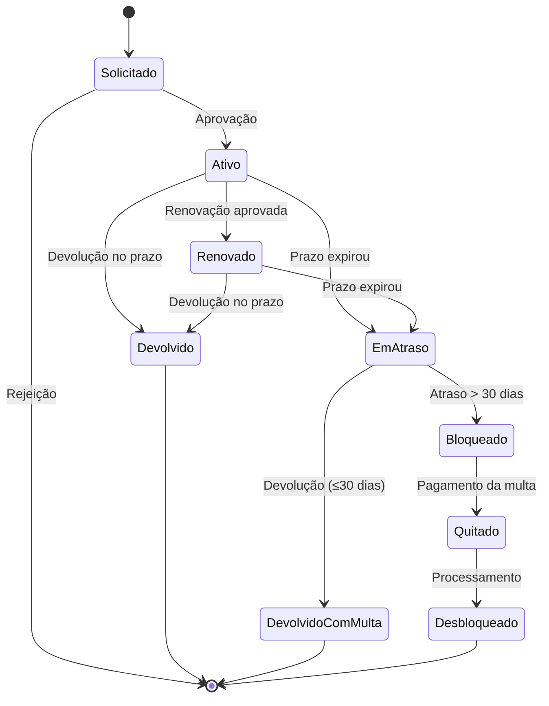

# 📚 Atividade Prática — Derivando Casos de Teste para um Sistema de Biblioteca

**Disciplina:** Qualidade de Software 
**Professor:** Prof. Claudio Nunes  
**Duração estimada:** 1h20  
**Formato:** Duplas ou trios  
**Pré-requisito:** Conceitos de caixa branca vs. caixa preta 

---

## 🎯 Objetivo

Aplicar as quatro principais técnicas de teste caixa preta — **Partição de Equivalência**, **Análise de Valor-Limite**, **Tabela de Decisão** e **Transição de Estado** — para derivar casos de teste a partir de uma especificação de requisitos, maximizando a cobertura com o menor número de testes possível.

---

## 📋 Especificação de Requisitos — Sistema BiblioTech

O **BiblioTech** é um sistema de gerenciamento de empréstimos de livros de uma biblioteca universitária. Abaixo estão as regras de negócio que governam o módulo de empréstimos.

### RN01 — Limite de Empréstimos Simultâneos

O número máximo de livros que um usuário pode ter emprestados simultaneamente depende do seu tipo:

| Tipo de Usuário | Limite de Empréstimos |
|-----------------|----------------------|
| Aluno           | 3 livros             |
| Professor       | 5 livros             |

- Se o usuário tentar emprestar um livro quando já atingiu seu limite, o sistema deve **rejeitar** a solicitação e exibir a mensagem: *"Limite de empréstimos atingido."*
- Se o tipo de usuário for desconhecido ou inválido, o sistema deve rejeitar a solicitação.

### RN02 — Prazo de Devolução

| Tipo de Usuário | Prazo de Devolução |
|-----------------|-------------------|
| Aluno           | 14 dias           |
| Professor       | 21 dias           |

### RN03 — Multa por Atraso

Quando um livro é devolvido após o prazo, o sistema calcula a multa com base na quantidade de **dias de atraso**:

| Dias de Atraso    | Valor da Multa  |
|-------------------|----------------|
| 1 a 7 dias        | R$ 1,00 por dia |
| 8 a 15 dias       | R$ 2,00 por dia |
| 16 a 30 dias      | R$ 3,00 por dia |
| Acima de 30 dias  | R$ 3,00 por dia + **bloqueio automático** |

**Fórmula da multa:** aplica-se a faixa correspondente ao total de dias de atraso (não acumulativa entre faixas).

> **Exemplo:** 10 dias de atraso → 10 × R$ 2,00 = R$ 20,00

### RN04 — Bloqueio do Usuário

- Atraso **superior a 30 dias** → bloqueio automático do usuário.
- Usuário bloqueado **não pode** realizar novos empréstimos nem renovações.
- O desbloqueio ocorre apenas após a **quitação total** da multa pendente.

### RN05 — Renovação de Empréstimo

A renovação de um empréstimo ativo é permitida **somente** quando **todas** as condições abaixo são satisfeitas:

| # | Condição                                          |
|---|---------------------------------------------------|
| 1 | O usuário **não está bloqueado**                  |
| 2 | O livro **não possui reserva pendente** de outro usuário |
| 3 | O empréstimo ainda **não foi renovado** anteriormente (máximo 1 renovação) |
| 4 | O empréstimo **não está em atraso**               |

Se qualquer condição não for atendida, a renovação é **negada** com mensagem específica indicando o motivo.

### RN06 — Ciclo de Vida do Empréstimo

O empréstimo possui os seguintes estados possíveis:

```
Solicitado → Ativo → Devolvido
                  → Em Atraso → Devolvido com Multa
                              → Bloqueado → Quitado → Desbloqueado
                  → Renovado → Devolvido
```

**Estados:**

| Estado             | Descrição                                                   |
|--------------------|-------------------------------------------------------------|
| Solicitado         | Usuário solicitou o empréstimo; aguardando aprovação        |
| Ativo              | Livro entregue ao usuário; prazo correndo                   |
| Renovado           | Empréstimo renovado; novo prazo em vigor                    |
| Em Atraso          | Prazo expirou sem devolução                                 |
| Devolvido          | Livro devolvido dentro do prazo                             |
| Devolvido com Multa| Livro devolvido após o prazo; multa calculada               |
| Bloqueado          | Atraso > 30 dias; usuário impedido de novas operações       |
| Quitado            | Multa paga; aguardando desbloqueio                          |
| Desbloqueado       | Usuário desbloqueado; pode operar novamente                 |

**Transições:**

| Estado Atual        | Evento/Condição                     | Estado Seguinte      |
|---------------------|--------------------------------------|---------------------|
| Solicitado          | Aprovação (limite não atingido)      | Ativo               |
| Solicitado          | Rejeição (limite atingido)           | *(cancelado)*       |
| Ativo               | Devolução dentro do prazo            | Devolvido           |
| Ativo               | Prazo expirou                        | Em Atraso           |
| Ativo               | Solicitar renovação (condições OK)   | Renovado            |
| Renovado            | Devolução dentro do novo prazo       | Devolvido           |
| Renovado            | Novo prazo expirou                   | Em Atraso           |
| Em Atraso           | Devolução (atraso ≤ 30 dias)         | Devolvido com Multa |
| Em Atraso           | Atraso > 30 dias                     | Bloqueado           |
| Bloqueado           | Devolução + pagamento da multa       | Quitado             |
| Quitado             | Processamento do desbloqueio         | Desbloqueado        |

---

## 🔧 Instruções da Atividade

Vocês devem aplicar as quatro técnicas de teste caixa preta ao sistema BiblioTech descrito acima. Sigam as etapas abaixo na ordem indicada.

### Etapa 1 — Partição de Equivalência (20 min)

Identifiquem as **variáveis de entrada** relevantes e dividam seus domínios em **classes de equivalência** (válidas e inválidas).

**Variáveis sugeridas para análise:**

- Tipo de usuário
- Quantidade de empréstimos ativos
- Dias de atraso (para cálculo de multa)
- Status do usuário (bloqueado / ativo)

**Formato de entrega — Tabela de Partições:**

| Variável | Classe | Faixa de Valores | Tipo (Válida/Inválida) | Valor Representativo |
|----------|--------|-------------------|------------------------|---------------------|
| Tipo de Usuário | C1 | "Aluno" | Válida | "Aluno" |
| Tipo de Usuário | C2 | "Professor" | Válida | "Professor" |
| Tipo de Usuário | C3 | Outro valor | Inválida | "Visitante" |
| Dias de atraso | C4 | 0 | Válida (sem multa) | 0 |
| Dias de atraso | C5 | 1–7 | Válida (faixa 1) | 4 |
| ... | ... | ... | ... | ... |

> 💡 **Dica:** Não se esqueçam das classes inválidas — elas frequentemente revelam defeitos!

---

### Etapa 2 — Análise de Valor-Limite (15 min)

Para cada partição identificada na Etapa 1, determinem os **valores-limite** — os pontos onde erros são mais prováveis.

**Formato de entrega — Tabela de Valores-Limite:**

| Variável | Limite | Valor | Resultado Esperado | Tipo |
|----------|--------|-------|--------------------|------|
| Dias de atraso | Inferior faixa 1 | 0 | Sem multa | Válido |
| Dias de atraso | Início faixa 1 | 1 | R$ 1,00 | Válido |
| Dias de atraso | Fim faixa 1 | 7 | R$ 7,00 | Válido |
| Dias de atraso | Início faixa 2 | 8 | R$ 16,00 | Válido |
| Empréstimos (Aluno) | No limite | 3 | Rejeitar próximo | Válido |
| Empréstimos (Aluno) | Acima do limite | 4 | Rejeitar | Inválido |
| ... | ... | ... | ... | ... |

> 💡 **Dica:** Para cada fronteira entre faixas, testem pelo menos o valor **no** limite e o valor **imediatamente após**.

---

### Etapa 3 — Tabela de Decisão para Renovação (25 min)

Construam uma **tabela de decisão** para a regra de renovação (RN05). Identifiquem as condições booleanas e todas as combinações possíveis.

**Condições a considerar:**

| # | Condição |
|---|----------|
| C1 | Usuário está bloqueado? |
| C2 | Livro tem reserva pendente? |
| C3 | Empréstimo já foi renovado? |
| C4 | Empréstimo está em atraso? |

**Modelo da Tabela de Decisão:**

|  | R1 | R2 | R3 | R4 | R5 | R6 | ... | R16 |
|--|----|----|----|----|----|----|-----|-----|
| **Condições** | | | | | | | | |
| C1: Bloqueado? | N | N | N | N | N | N | ... | S |
| C2: Reserva pendente? | N | N | N | N | S | S | ... | S |
| C3: Já renovado? | N | N | S | S | N | N | ... | S |
| C4: Em atraso? | N | S | N | S | N | S | ... | S |
| **Ações** | | | | | | | | |
| Permitir renovação? | ✅ | ❌ | ❌ | ❌ | ❌ | ❌ | ... | ❌ |
| Motivo da negação | — | Atraso | Já renovado | Atraso | Reserva | Reserva | ... | Todos |

> 💡 **Dica:** Com 4 condições binárias, existem 2⁴ = **16 combinações**. Apenas **1** delas (R1) permite a renovação. Vocês podem simplificar agrupando regras com o mesmo resultado, mas documentem pelo menos **8 regras** representativas.

---

### Etapa 4 — Diagrama de Transição de Estados (20 min)

Modelem o **ciclo de vida do empréstimo** (RN06) como um diagrama de transição de estados.

**O que entregar:**

1. **Diagrama visual** — desenhem os estados como retângulos/círculos e as transições como setas rotuladas. Podem usar papel, quadro, ou ferramenta online (draw.io, Mermaid, etc.).

2. **Tabela de transições** com casos de teste derivados:

| CT ID | Estado Atual | Evento | Estado Esperado |
|-------|-------------|--------|-----------------|
| CT-E01 | Solicitado | Aprovação | Ativo |
| CT-E02 | Solicitado | Rejeição (limite) | Cancelado |
| CT-E03 | Ativo | Devolução no prazo | Devolvido |
| ... | ... | ... | ... |

**Exemplo de diagrama em Mermaid (para quem preferir):**



---

### Etapa 5 — Documentação dos Casos de Teste (restante do tempo)

Consolidem o trabalho das etapas anteriores em uma **planilha de casos de teste** com no mínimo **15 casos de teste**.

**Formato obrigatório:**

| ID | Técnica Utilizada | Pré-condição | Entrada | Resultado Esperado |
|----|-------------------|-------------|---------|-------------------|
| CT-01 | Partição de Equivalência | Aluno com 2 empréstimos ativos | Solicitar empréstimo | Empréstimo concedido |
| CT-02 | Valor-Limite | Aluno com 3 empréstimos ativos | Solicitar empréstimo | "Limite de empréstimos atingido." |
| CT-03 | Tabela de Decisão | Aluno ativo, sem reserva, sem renovação anterior, sem atraso | Solicitar renovação | Renovação permitida |
| CT-04 | Transição de Estado | Empréstimo no estado "Ativo" | Prazo expira | Estado muda para "Em Atraso" |
| ... | ... | ... | ... | ... |

**Distribuição mínima sugerida:**

| Técnica | Quantidade Mínima |
|---------|-------------------|
| Partição de Equivalência | 4 CTs |
| Análise de Valor-Limite | 4 CTs |
| Tabela de Decisão | 4 CTs |
| Transição de Estado | 3 CTs |
| **Total mínimo** | **15 CTs** |

---

## 📦 Entregáveis

Cada grupo deve entregar **um único documento** (PDF, Word ou planilha) contendo:

1. **Tabela de Partições de Equivalência** (Etapa 1)
2. **Tabela de Valores-Limite** (Etapa 2)
3. **Tabela de Decisão da Renovação** (Etapa 3)
4. **Diagrama de Transição de Estados** + tabela de transições (Etapa 4)
5. **Planilha consolidada com 15+ Casos de Teste** (Etapa 5)

---


## 📚 Referências

- ISTQB Foundation Level Syllabus v4.0 — Capítulo 4: Técnicas de Teste
- DELAMARO, M. E.; MALDONADO, J. C.; JINO, M. *Introdução ao Teste de Software*. Elsevier, 2016.
- Material de aula — Teste de Software (disponibilizado em aula)

---

> **Boa atividade!** Lembrem-se: o objetivo não é apenas criar testes, mas entender *por que* cada técnica escolhida é a mais adequada para cada cenário. 🎯
