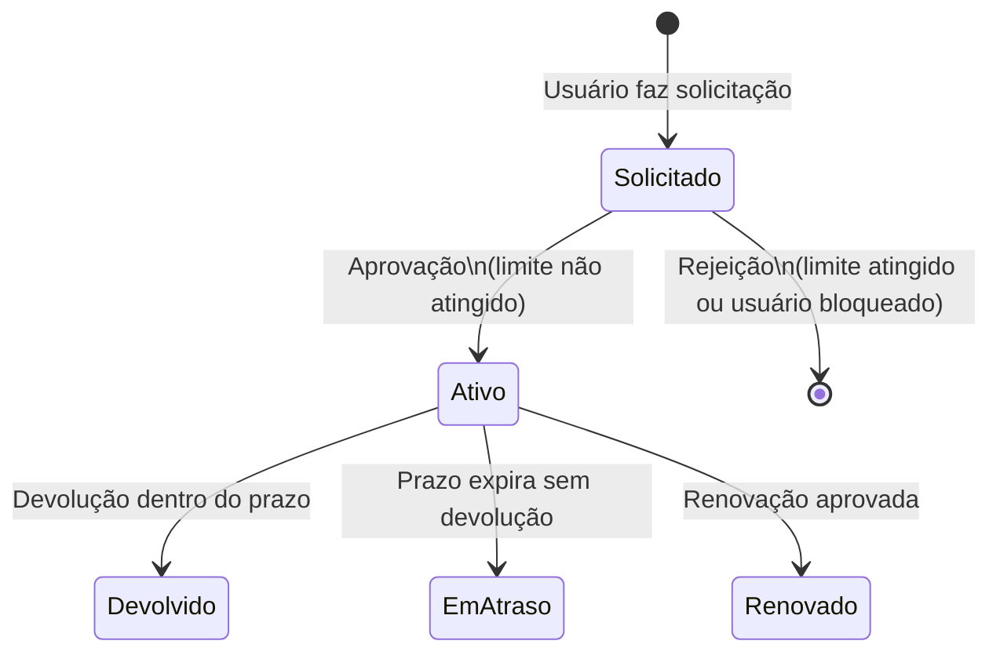

# Exemplo — Transição de Estado

> **Como usar este arquivo:** Leia o exemplo completo abaixo para entender a lógica da técnica e o formato de entrega. Depois, aplique o mesmo raciocínio ao ciclo de vida completo do empréstimo (RN06) na Etapa 4 do roteiro.

---

## Contexto do Exemplo

Vamos aplicar Teste de Transição de Estado a um ciclo **simplificado** — apenas a parte inicial do empréstimo, cobrindo os estados **Solicitado** e **Ativo**.

### Diagrama do Trecho



---

## Passo 1 — Listar os Estados e Transições

| # | Estado Atual | Evento / Condição                        | Estado Seguinte | Ação do Sistema                              |
|---|-------------|------------------------------------------|-----------------|----------------------------------------------|
| T1 | *(inicial)* | Usuário solicita empréstimo              | Solicitado      | Registra solicitação                         |
| T2 | Solicitado  | Aprovação (limite não atingido, não bloqueado) | Ativo      | Entrega o livro; inicia contagem do prazo    |
| T3 | Solicitado  | Rejeição (limite atingido)               | *(cancelado)*   | Exibe "Limite de empréstimos atingido."       |
| T4 | Solicitado  | Rejeição (usuário bloqueado)             | *(cancelado)*   | Exibe "Usuário bloqueado."                   |
| T5 | Ativo       | Devolução dentro do prazo                | Devolvido       | Registra devolução sem multa                 |
| T6 | Ativo       | Prazo expira sem devolução               | Em Atraso       | Marca empréstimo como "Em Atraso"            |
| T7 | Ativo       | Renovação aprovada (todas condições OK)  | Renovado        | Estende prazo; marca como "Renovado"         |

---

## Passo 2 — Derivar Casos de Teste (uma transição por CT)

A estratégia básica é cobrir **cada seta do diagrama** com pelo menos um caso de teste:

| ID     | Técnica               | Estado Inicial | Evento / Ação                                  | Estado Final Esperado | Verificação adicional                         |
|--------|-----------------------|---------------|------------------------------------------------|-----------------------|-----------------------------------------------|
| CT-E01 | Transição de Estado   | *(nenhum)*    | Aluno ativo solicita livro (sem limite atingido) | Solicitado           | Solicitação registrada no sistema             |
| CT-E02 | Transição de Estado   | Solicitado    | Sistema aprova (aluno tem 0 empréstimos ativos) | **Ativo**            | Prazo de 14 dias iniciado; livro marcado como emprestado |
| CT-E03 | Transição de Estado   | Solicitado    | Sistema rejeita (aluno já tem 3 empréstimos)   | **Cancelado**         | Mensagem: "Limite de empréstimos atingido."   |
| CT-E04 | Transição de Estado   | Solicitado    | Sistema rejeita (usuário está bloqueado)       | **Cancelado**         | Mensagem: "Usuário bloqueado."                |
| CT-E05 | Transição de Estado   | Ativo         | Aluno devolve o livro no 10º dia (prazo = 14 dias) | **Devolvido**     | Multa = R$ 0,00; empréstimo encerrado         |
| CT-E06 | Transição de Estado   | Ativo         | Prazo vence (15º dia sem devolução)            | **Em Atraso**         | Sistema atualiza status automaticamente       |
| CT-E07 | Transição de Estado   | Ativo         | Aluno solicita renovação (todas condições OK)  | **Renovado**          | Novo prazo = 14 dias; renovação registrada    |

---

## Passo 3 — Testar Transições Inválidas (opcional — avançado)

Além das transições válidas, podemos verificar que o sistema **bloqueia** transições que não existem no diagrama:

| ID     | Técnica               | Estado Atual | Evento Inválido                          | Comportamento Esperado                    |
|--------|-----------------------|--------------|------------------------------------------|-------------------------------------------|
| CT-E08 | Transição de Estado   | Devolvido    | Tentar devolver novamente                | Sistema rejeita: empréstimo já encerrado  |
| CT-E09 | Transição de Estado   | Solicitado   | Tentar renovar (ainda não está Ativo)    | Sistema rejeita: renovação não permitida  |

> **Por que testar transições inválidas?** Um sistema bem implementado deve recusar operações fora do fluxo definido. Se um sistema no estado "Devolvido" aceitar uma segunda devolução, há um defeito.

---

## Resumo: Cobertura Recomendada

| Nível de Cobertura | Descrição                                                    |
|--------------------|--------------------------------------------------------------|
| **Mínima**         | Cobrir todos os **estados** — pelo menos 1 CT por estado     |
| **Básica**         | Cobrir todas as **transições válidas** — 1 CT por seta       |
| **Completa**       | Cobrir transições válidas + principais **transições inválidas** |

Para esta atividade, o objetivo é atingir a cobertura **básica** (todas as setas do diagrama).

---

## Template para Preenchimento

**Tabela de transições com casos de teste:**

```
| ID      | Técnica             | Estado Inicial    | Evento / Ação         | Estado Final Esperado | Verificação         |
|---------|---------------------|-------------------|-----------------------|-----------------------|---------------------|
| CT-E??  | Transição de Estado | <estado de início>| <o que acontece>      | <estado resultante>   | <o que verificar>   |
```

**Dica:** percorra o diagrama seta por seta e escreva um caso de teste para cada uma delas. Se uma seta não tiver caso de teste correspondente, sua cobertura está incompleta.
